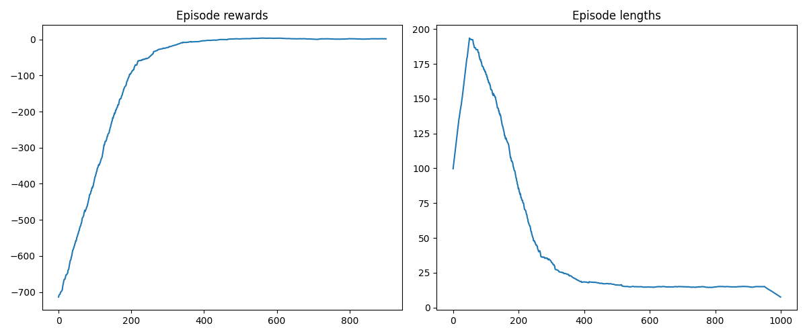
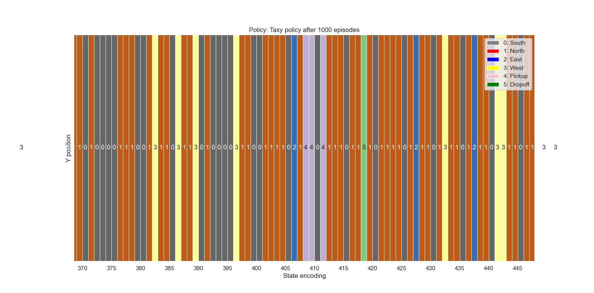

# Gymnasium Taxi Agent

## 1 Problem Description

The Taxi Problem involves navigating to passengers in a grid world, picking them up and dropping them
off at one of four locations.

## 1.1 Description of the environment

There are four designated pick-up and drop-off locations (Red, Green, Yellow and Blue) in the
5x5 grid world. The taxi starts at a random square and the passenger at one of the
designated locations. The goal is to move the taxi to the passenger's location, pick up the passenger,
move to the passenger's desired destination, and
drop off the passenger. Once the passenger is dropped off, the episode ends.

The player receives positive rewards for successfully dropping off the passenger at the correct
location. Negative rewards for incorrect attempts to pick up/drop off the passenger and
for each step where another reward is not received.

Map:

        +---------+
        |R: | : :G|
        | : | : : |
        | : : : : |
        | | : | : |
        |Y| : |B: |
        +---------+

## 1.2 Action Space

The action shape is `(1,)` in the range `{0, 5}` indicating
which direction to move the taxi or to pick up/drop off the passenger.

- 0: Move south (down)
- 1: Move north (up)
- 2: Move east (right)
- 3: Move west (left)
- 4: Pickup passenger
- 5: Drop off the passenger

## 1.3 Observation Space

There are 500 discrete states since there are 25 taxi positions, 5 possible
locations of the passenger (including the case when the passenger is in the
taxi), and 4 destination locations.

Destinations on the map are represented with the first letter of the color.

Passenger locations:

- 0: Red
- 1: Green
- 2: Yellow
- 3: Blue
- 4: In the taxi

Destinations:

- 0: Red
- 1: Green
- 2: Yellow
- 3: Blue

An observation is returned as an `int()` that encodes the corresponding state, calculated by
`((taxi_row * 5 + taxi_col) * 5 + passenger_location) * 4 + destination`

Note that there are only 400 states that can be reached during an
episode. The missing states correspond to situations in which the passenger
is at the exact location as their destination, as this typically signals the
end of an episode. Four additional states can be observed right after a
successful episode when both the passenger and the taxi are at the destination.
This gives a total of 404 reachable discrete states.

## 1.4. Starting State

The episode starts with the player in a random state.

## 1.5 Rewards

- -1 per step unless another reward is triggered.
- +20 delivering the passenger.
- -10  executing "pickup" and "drop-off" actions illegally.

An action that results in a noop (no operation), like moving into a wall, will incur the time step
penalty. Noops can be avoided by sampling the `action_mask` returned in `info`.

## 1.6 Episode End

The episode ends if the following happens:

- Termination:
        1. The taxi drops off the passenger.
- Truncation (when using the time_limit wrapper):
        1. The length of the episode is 200.

## 1.7 Information

`step()` and `reset()` return a dict with the following keys:

- p - transition probability for the state.
- action_mask - if actions will cause a transition to a new state.

As the taxi is not stochastic, the transition probability is always 1.0.
In some cases, taking action will not affect the state of the episode.
In v0.25.0, ``info["action_mask"]`` contains an ``np.ndarray`` for each of the actions specifying
if the action will change the state.

To sample a modifying action, use ``action = env.action_space.sample(info["action_mask"])``.
Or with a Q-value based algorithm ``action = np.argmax(q_values[obs, np.where(info["action_mask"] == 1)[0]])``.

## 2 Proposed Solution

We will use a Q-learning algorithm that uses a neural network to approximate the Q-values.

### 2.1 Q-learning

#### 2.1.1 Initial considerations

In the proposed solution, we will avoid the facilities provided by the Gymnasium environment to avoid the agent to take bad actions. Indeed, using ``info["action_mask"]`` to choose the next action, it is possible to avoid 'Pickup passenger' and 'Drop off the passenger' actions when they are not possible. As a consequence, our agent can receive the negative reward -10 by executing "pickup" and "drop-off" actions illegally.

Another consideration is the encoding of the state. We can observe that for each state (taxi_row, taxi_col, passenger_location, destination) there is only one possible encoding following the formula above and vice versa, starting from the encoding we can exactly establish the state (taxi_row, taxi_col, passenger_location, destination).
The last one is the least easy to understand, but we can reason as follows:

- Pick a state e.g. taxi_row = 2, taxi_col = 3, passenger_location = 0, destination = 3
- Compute the encoding: ``((2 * 5 + 3) * 5 + 0) * 4 + 3 = 263``
- Now we revert the encoding starting from the formula ``((taxi_row * 5 + taxi_col) * 5 + passenger_location) * 4 + destination``. 
We can observe that ``(263 - destination) mod 4 = 0``, and ``destination`` belongs to ``[0, 3]`` , which means that there aren't two different values of ``destination`` that satisfies ``(263 - destination) mod 4 = 0``. i.e. ``(263 - 0) mod 4 = 3``, ``(263 - 1) mod 4 = 2``, ``(263 - 2) mod 4 = 1``, ``(263 - 3) mod 4 = 0``.
We have found that ``difference = 3`` and ``(taxi_row * 5 + taxi_col) * 5 + passenger_location = 65``. Using the same reasoning we can find: ``(65 - 0) % 5 = 0``, so ``passenger_location = 0``, then ``(13 - 3) % 5 = 0``, so ``taxi_col = 3``, and finally ``10 / 5 = 2``, so ``taxi_row = 2``.

#### 2.1.2 The Taxi Agent

The agent is responsible for computing the new value for a q-table after executing an action on the environment. Indeed, the environment returns to the agent the reward of the action and the next state. The new value of the q-table is the following:
$$Q_{table}(state, action) = reward + discoun\_factor * max_{action'}(Q_{table}(next\_state, action'))$$

The ``discount_factor`` is useful to increase the value of close rewards instead of future rewards.

The action is chosen considering the trade-off between exploration and exploitation. At the start we want to explore the environment by choosing random acts and collecting rewards, then we want to exploit the action which gives us the best rewards. So, by using a variable ``epsilon = 1``, we choose a random action with probability ``epsilon`` and we exploit the action with the maximum reward with probability ``1 - epsilon``. After completing an episode we decrease ``epsilon`` to facilitate exploitation.

#### 2.1.3 Training the Taxi Agent

In the training phase we repeat, for a fixed number of times called episodes, the following:

- Choose the action
- Compute the action in the environment
- Collect the reward by updating the q-table
- If the episode terminates by completing the goal, or reaching the maximum number of actions which is 200, it stops.

After an episode, the ``epsilon`` is decreased.

#### 2.1.4 Evaluation

During the training, we collect some statistics with the help of the environment to evaluate how fast the learning is. Two indicators of learning are the cumulative rewards during the episodes and the episode length. To make these two graphs smoother, we use a rolling average by computing an average for near episodes.

Training the agent with 1000 episodes, which lasts about 2 seconds, the two graphs are:

We can see that after 100 episodes, the episode length decreases drastically up to 400 episodes.

Also, we can print the optimal policy using a heatmap like this:

Finally, the agent following this optimal policy will act as follows:

https://github.com/simonescaccia/Gymnasium-Taxi-Agent/assets/72872543/78e18c01-2bda-469f-bf5e-abe0f9c835ff

### 2.2 Deep Q-learning

We use a neural network to approximate the Q-values. A q-table requires a lot of space, in our case we have a q-table of 500 states * 6 actions = 3000 entries, also we need a lot of iteration in Q-learning to visit these entries many times.

#### 2.2.1 Neural Network Architecture

- Target function f: ``X -> R^|Y|``, X set of states, Y set of actions (policy training)
- Input layer:  

## 3 Resources

### 3.1 Documentation

[Gymnasium Taxi documentation](https://gymnasium.farama.org/environments/toy_text/taxi/#taxi_ref)

### 3.2 Dependencies

        python -m pip install gymnasium
        python -m pip install gymnasium[toy-text]
